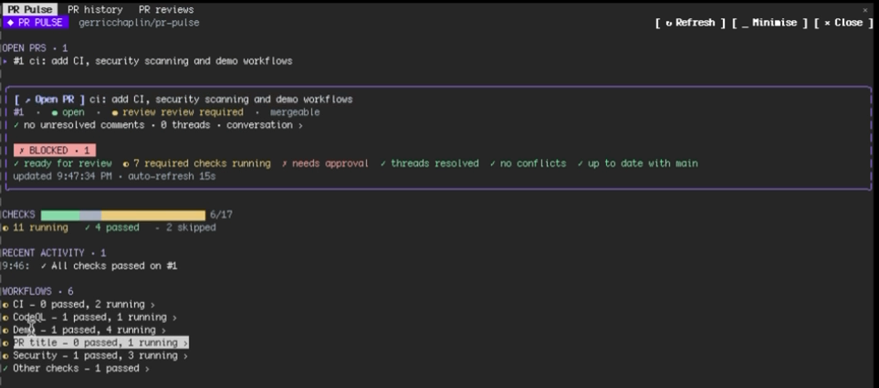

# PR Pulse

[](https://github.com/gerricchaplin/pr-pulse/actions/workflows/ci.yml)
[](https://github.com/gerricchaplin/pr-pulse/actions/workflows/codeql.yml)
[](https://github.com/gerricchaplin/pr-pulse/actions/workflows/security.yml)
[](https://scorecard.dev/viewer/?uri=github.com/gerricchaplin/pr-pulse)
[](LICENSE)

Live GitHub pull-request status inside [Claude Code](https://claude.com/claude-code): checks, merge readiness, review comments, your review queue and change alerts, without leaving the terminal.



## Install

```text
/plugin marketplace add gerricchaplin/pr-pulse
/plugin install pr-pulse@pr-pulse
```

Requires the [GitHub CLI](https://cli.github.com) (`gh`), signed in (`gh auth status`). PR Pulse makes every GitHub call through `gh`, as you.

## Use

Run `/pulse` in a GitHub repo. Optional argument: `owner/repo`, `owner/repo#123` or a PR URL.

- **PR Pulse pane**: your open PRs, a merge-readiness verdict (`✓ READY TO MERGE`, `✗ BLOCKED · n`, `◐ WAITING ON CHECKS`) with the checklist behind it, a check bar, failed checks first, and drill-down from workflow to job to steps with a failure-log excerpt.
- **Comments**: unresolved review threads, the conversation and resolved threads.
- **PR history**: your PRs and everyone's merged in the last 7 days.
- **PR reviews**: PRs waiting on you, and on your teams.
- **Alerts**: toasts and a recent-activity list when a check fails or all pass, a review lands, someone comments, the PR becomes ready to merge, or a review is requested from you.
- **Fix with Claude / Address with Claude**: drafts a prompt from a failed check's log or a review thread into your prompt box. Nothing is sent until you press Enter.
- **Minimise** (`m`): the panes collapse to a one-line band above the prompt; polling and alerts carry on. `/pulse` or `e` expands.

Keys while a pane is focused: `r` refresh, `m` minimise, `q` close, `o` open the PR in the browser.

## Security

PR Pulse has no dependencies and a deliberately small reach: it runs only `gh`, `git`, `uname` and `open`/`xdg-open` (for `https://` links), never writes files, never calls a model and never sends a prompt for you. CI fails if that reach grows without review. Details, the checks this repository runs, and how to report a vulnerability: [SECURITY.md](SECURITY.md).

## GitHub API use

PR Pulse polls (a local plugin cannot receive webhooks): every 15 s for your PRs and checks, every 60 s for history, the review queue and branch status. All calls are serial and go through your own `gh` token, sharing its hourly limits with everything else you run.

## Try it on this repo

This repository doubles as a demo target. `scripts/demo.sh <scenario>` opens a throwaway draft PR in a known state:

| Scenario | What PR Pulse shows |
|---|---|
| `green` | all checks pass, the "✓ All checks passed" alert |
| `fail` | a failing build with its error log, and **Fix with Claude** |
| `slow` | a two-minute check: the pane goes from running to green |
| `flaky` | fails, then passes after `gh run rerun --failed` without a false alert |
| `skip` | a skipped optional check |
| `title` | the required `pr-title` check failing |

`scripts/demo.sh clean` closes them all.

## Develop

```sh
npm ci                                   # pinned Claude Code
npx claude plugin validate .
npx claude plugin test .
python3 scripts/check-capabilities.py    # fails if the plugin's reach changed
```

Guidance for contributors and coding agents: [AGENTS.md](AGENTS.md).

## License

MIT
